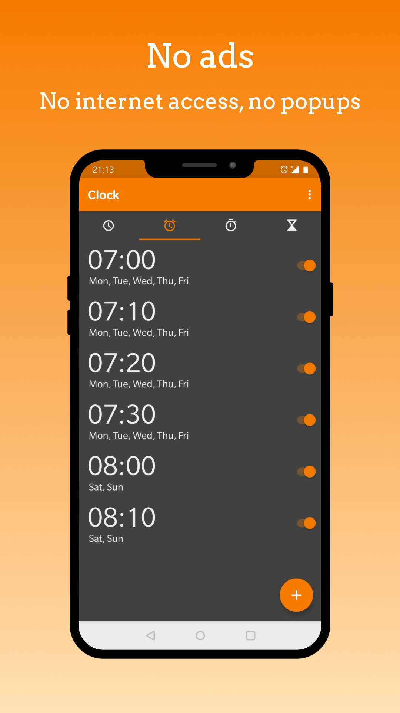

# Simple Clock with Broadcast events
This is a fork of the SimpleMobileTools Simple Clock application. I have added broadcast events to alarms for home automation purposes, the broadcasts are called silent alarms.

A silent alarm is a non audible alarm, represented as a broadcast to the system which can be processed by other applications such as Tasker, Easer, Broadcast to mqtt or other tools for scenarios such as home automation. 

Following broadcasts are emitted: 
- com.simplemobiletools.ALARM_SET : when a new Alarm is created.
- com.simplemobiletools.ALARM_GOING_TO_RING : when a silent alarm is triggered - only if the main alarm is enabled.
- com.simplemobiletools.ALARM_IS_ACTIVE when an audible alarm is active.
- com.simplemobiletools.ALARM_SNOOZED when an audible alarm has been snoozed.
- com.simplemobiletools.ALARM_DISABLED when an audible alarm has been disabled.

All broadcasts contain the same payload with the attributes:
- label
- hours  
- minutes
- days
- id

## Example usage scenarios
I use the silent alarms to trigger actions before, during, or after an alarm rings. 

- Trigger a wakeup light before the audible alarm rings
- Trigger a wakeup routine once the audible alarm rings
- Have automated actions if you use the snooze button to often :-)
- ... 

# Original Simple Clock readme

The app has multiple functions related to timing.

At the clock you can enable displaying times from other timezones, or use the simple, but customizable clock widget. The text color of the widget can be customized, as well as the color and the alpha of the background.

The alarm contains all the expected features as day selecting, vibration toggling, ringtone selecting, snooze or adding a custom label.

With the stopwatch you can easily measure a longer period of time, or individual laps. You can sort the laps by lap time, it contains optional vibrations on button presses too, just to let you know that the button was pressed, even if you cannot look at the device.

You can easily setup a timer to be notified of some event. You can both change its ringtone, or toggle vibrations.

Additional features include preventing the device from falling asleep while the app is in foreground, or displaying some tabs in fullscreen view.

Contains no ads or unnecessary permissions. It is fully opensource, provides customizable colors.

This app is just one piece of a bigger series of apps. You can find the rest of them at https://www.simplemobiletools.com

