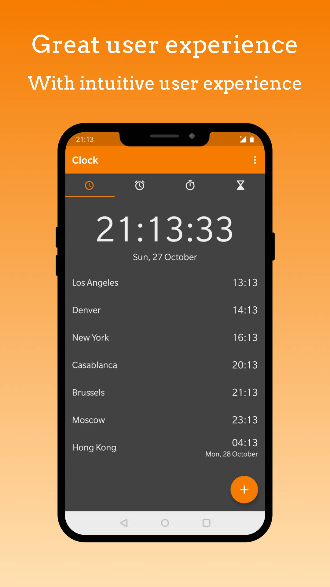

# Simple Clock with Broadcast events
This is a fork of the SimpleMobileTools Simple Clock application. I have added broadcast events to alarms for home automation purposes, the broadcasts are called silent alarms.

A silent alarm is a non audible alarm, represented as a broadcast to the system which can be processed by other applications such as Tasker, Easer, Broadcast to mqtt or other tools for scenarios such as home automation. 

## Features
* "Silent alarms"
* "Alter, create and disable/enable alarms using intents via ADB or apps like Tasker

## Example usage scenarios
Forward broadcasts and the respective payload to an mqtt broker and have your smart home such as home assistant react to your alarms dynamically with automations such as:

- Trigger a wakeup light before the audible alarm rings
- Trigger a wakeup routine once the audible alarm rings
- Have automated actions if you use the snooze button to often :-)
- ... 

## Disclaimer

- I am not responsible, if the app messes up and you are late for anything ;) 

# Usage
Usage is generally intended with other companion apps such as Broadcast2mqtt, Tasker or Easer.

## Emitted broadcasts
Following broadcasts are emitted: 
- com.simplemobiletools.ALARM_SET : when a new Alarm is created.
- com.simplemobiletools.ALARM_GOING_TO_RING : when a silent alarm is triggered - only if the main alarm is enabled.
- com.simplemobiletools.ALARM_IS_ACTIVE when an audible alarm is active.
- com.simplemobiletools.ALARM_SNOOZED when an audible alarm has been snoozed.
- com.simplemobiletools.ALARM_DISABLED when an audible alarm has been disabled.

All broadcasts contain the same payload with the attributes:
- label
- hours  
- minutes
- days
- id

## About silent alarms
Silent alarms 

* have their own id
* have the same label as the calling alarm
* do not emit broadcasts

Configuration example using the app broadcast2mqtt

## Alter alarms via intent
This app listens for intents sent to "android.intent.action.SEND" to the package "com.simplemobiletools.clock". The alarm id can be obtained in the UI **after** storing the alarm the first time.

The Intent may have following payload:

Following modes options are supported: 
**INSERT**: Create new alarm
**UPDATE**: Modify existing alarm
**DISABLE**: Disable alarm
**ENABLE**: Enable alarm 

### Payloads
**MODE**: INSERT

| Payload  | Value                       |Required |
|--------- |-----------------------------|---------|
| MODE     | (INSERT | UPDATE | DISABLE) | YES     |
| ALARM_ID | INT                         | NO      |         
| LABEL    | String                      | YES     |
| MINUTES  | INT                         | YES     |
| HOURS    | INT                         | YES     |

#### Example ADB command
    adb shell am start -a android.intent.action.SEND -t text/plain --es MODE INSERT --es LABEL "NEW_TEST_INTENT_LABEL_2" --ei "HOURS" 25 --ei "MINUTES" 65 com.simplemobiletools.clock

**MODE**: UPDATE

| Payload | Value | Required |
|---------|-------|----------|
|MODE     |UPDATE | YES      |
|ALARM_ID | INT	  | YES      |
|LABEL    | String| NO       |
|MINUTES  | INT   | NO       |
|HOURS    | INT   | NO       |

#### Example ADB command
    adb shell am start -a android.intent.action.SEND -t text/plain  --ei ALARM_ID 1 --es MODE UPDATE --es LABEL "NEW_TEST_INTENT_LABEL_3" --ei HOURS 25 --ei "MINUTES" 65 com.simplemobiletools.clock

## Example ADB Call

**MODE**: ENABLE/DISABLE
| Payload | Value          | Required |
|---------|----------------|----------|
|MODE     | ENABLE/DISABLE | YES      |
|ALARM_ID | INT	           | YES      |

##### Example ADB Call
    adb shell am start -a android.intent.action.SEND -t text/plain  --ei ALARM_ID 1 --es MODE DISABLE com.simplemobiletools.clock

## Tasker Config Example
In Tasker, create a "new intent" action in the "Tasks" section with the config as shown in the image below.

# Original Simple Clock readme

The app has multiple functions related to timing.

At the clock you can enable displaying times from other timezones, or use the simple, but customizable clock widget. The text color of the widget can be customized, as well as the color and the alpha of the background.

The alarm contains all the expected features as day selecting, vibration toggling, ringtone selecting, snooze or adding a custom label.

With the stopwatch you can easily measure a longer period of time, or individual laps. You can sort the laps by lap time, it contains optional vibrations on button presses too, just to let you know that the button was pressed, even if you cannot look at the device.

You can easily setup a timer to be notified of some event. You can both change its ringtone, or toggle vibrations.

Additional features include preventing the device from falling asleep while the app is in foreground, or displaying some tabs in fullscreen view.

Contains no ads or unnecessary permissions. It is fully opensource, provides customizable colors.

This app is just one piece of a bigger series of apps. You can find the rest of them at https://www.simplemobiletools.com

